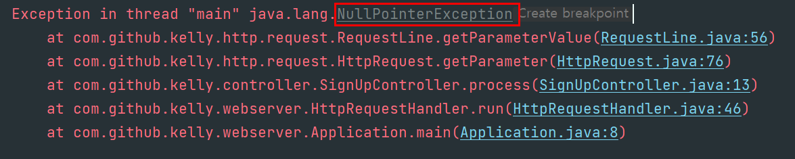

# URL에 쿼리 스트링이 없을 때


<br>
<br>

## **원인 파악**
## **1. HttpRequestHandler.java**
```java
@Override
    public void run() {
        ...
        controller.process(httpRequest, httpResponse);
        ...
    }
```
- 여기서 controller = SignUpController 를 말한다.
- SignUpController의 process 메소드를 호출한다.

## **2. SignUpController.java**
```java
@Override
public void process(HttpRequest httpRequest, HttpResponse httpResponse) {
    ...
    String userId = httpRequest.getParameter("userId");
    ...
}
```
- userId     
  html 파일의 `<form action="/signup" mehtod="post">`를 통해서 넘어온 데이터

## **3. HttpRequest.java**
```java
public String getParameter(String key) {
    String parameterValue = requestLine.getParameterValue(key);   // 원인 
    if (parameterValue != null) {
        return parameterValue;
    }
    return requestBody.getBodyResourceValue(key);
}
```
- 예상한 흐름:   
  - ① POST 요청을 하면서 request body 에 리소스들을 넘겼으므로 requestLine.getParameterValue(key)의 반환값으로는 null 이 넘어올 것이라 예상.  
  - ② parameterValue 가 null 이므로 if 문의 조건에 해당하지 않으니 requestBody.getBodyResourceValue(key) 를 실행해 requestBodyMap 에서 `userId`(key) 에 해당하는 value 값을 반환할 것으로 예상.

- 발생한 문제:  
  `String parameterValue = requestLine.getParameterValue(key);`   
  이 코드에서 NullPointerException 발생.

- 추측:  
  `requestLine.getParameterValue(key)` -> 메소드를 찾아보자.

## **4. RequestLine.java**
```java
    ...
    private QueryString queryString = null;   // here
    ...


    public RequestLine(String line) {
        String[] components = line.split(" ");

        this.httpMethod = HttpMethod.valueOf(components[METHOD_INDEX]);
        this.protocol = components[PROTOCOL_INDEX];

        String[] urlAndParameters = divideUrlAndParameters(components[URL_INDEX]);  // here
        final int URL = 0;
        final int PARAMETERS = 1;

        this.url = urlAndParameters[URL];

        // here
        if (urlAndParameters.length > 1) {
            this.queryString = new QueryString(urlAndParameters[PARAMETERS]);
        }
    }

    public String getParameterValue(String key) {
        return queryString.getParameterValue(key);
    }
```
- getParameterValue(String key)  
queryString.getParameterValue(key)을 실행한 결과 null 을 반환해야 한다. 여기서 queryString 이 가리키고 있는 값을 살펴보자.

- RequestLine 객체를 생성했을 때 일어나는 일  
  - RequestLine 생성자의 코드를 실행하자.  
   urlAndParameters[0]: url  
   urlAndParameters[1]: parameter 라는 의도로 작성함.

  - urlAndParameters.length > 1  
    URL에 parameter 를 넘기지 않았다면 urlAndParameters 의 길이는 parameter 가 없으므로 0이다.

  - if 문의 조건을 만족해야 QueryString 의 객체가 생성되므로 if 문의 조건을 만족하지 않는 경우(즉, 파라미터를 안넘겼을 경우)에는 QueryString 객체가 생성되지 않는다. 
  
  - `private QueryString queryString = null;`  
  RequestLine 의 멤버 필드에서 queryString = null 로 초기화를 해놨다. 💩
  RequestLine 생성자에서 QueryString 객체가 생성되지 않으므로 queryString 은 null로 초기화가 된 상태.

- `requestLine.getParameterValue(key)`  
위 코드로 다시 돌아가서 코드 흐름을 실행해보자.  
queryString.getParameterValue(key);  
null 로 초기화된 queryString에 접근한 순간(.) NullPointerException이 발생한다.
<br>
<br>

## **개선 내용**
## **1. 원래 의도**
- url에 항상 쿼리 스트링을 넘기진 않으므로, RequetLine의 QueryString 을 null 로 초기화를 시켰다.

- 멤버 필드에서 null로 초기화된 객체는 생성자에서 따로 다시 초기화 되는 과정이 없기 때문에 쿼리스트링을 넘기지 않았을 때 계속 null인 상태이다. 이를 생각해두지않고 코드를 짰다.

## **2. 개선점**
- url에 쿼리 스트링이 있든 없든 QueryString 생성자에 url을 넘긴다.  
- url 에서 쿼리 스트링을 분리해내는 작업은 QueryString의 역할로 둔다. (책임과 역할 분리)
- QueryString 의 map 에서 key 에 대응하는 value 값이 없는 경우 null 값을 반환하게 하고, null 값 검사 여부 후 코드를 실행하는 데 문제 없게 만든다.

### 2.1 RequestLine.java
```java
...
private final QueryString queryString;
...

public RequestLine(String line) {
        String[] components = line.split(" ");
        ...
        this.url = parseUrl(components[URL_INDEX]);
        ...
        this.queryString = new QueryString(components[URL_INDEX]);
}

public String getParameterValue(String key) {
        return queryString.getParameterValue(key);
}
```

### 2.2 QueryString.java
```java
public class QueryString {

    private final String queryStringOrNull;
    private final Map<String, String> queryStringMap = new HashMap<>();


    public QueryString(String rawUrl) {
        this.queryStringOrNull = parseQueryString(rawUrl);
        createQueryStringMap();
    }

    private void createQueryStringMap() {
        if (queryStringOrNull != null) {  
            Arrays.stream(queryStringOrNull.split("&"))
                    .forEach(keyAndValueString -> {
                        String[] keyAndValueComponents = keyAndValueString.split("=");
                        queryStringMap.put(keyAndValueComponents[0], keyAndValueComponents[1]);
                    });
        }
    }

    private String parseQueryString(String rawUrl) {
        if (rawUrl.contains("?")) {
            return rawUrl.split("\\?")[1];
        }
        return null;
    }

    // refactoring 대상
    public Map<String, String> getQueryStringMap() {
        return queryStringMap;
    }

    public String getRawQueryString() {
        return queryStringOrNull;
    }

    public String getParameterValue(String key) {
        return queryStringMap.get(key);
    }
}
```
<br>
<br>


## **개선 결과**
## 1. HttpRequest.java
```java
public String getParameter(String key) {
    String parameterValue = requestLine.getParameterValue(key);
        
    if (parameterValue != null) {
        return parameterValue;
    }
    return requestBody.getBodyResourceValue(key);
}
```
- Post 요청, request body 에 리소스를 넘긴 상태  
requestLine.getParameterValue(key)를 실행한 결과 null이 반환되고, parameterValue는 null 이기 때문에 if 조건문을 실행하지 않는다.

- requestBody.getBodyResourceValue(key)  
requestBody 에 정의해놓은 map에서 key에 대응하는 value 값을 반환 받는다.

## **SignUpController.java**
```java
@Override
public void process(HttpRequest httpRequest, HttpResponse httpResponse) {
    ...
    String userId = httpRequest.getParameter("userId");
    ...
}
- requestBody의 map에서 userId로 찾은 value 값을 반환받는다.